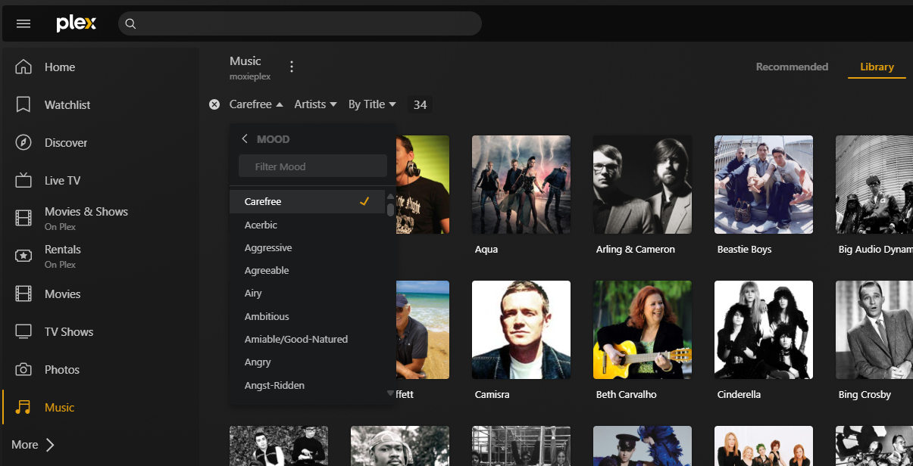

  

  <h1 style="margin: 0; flex: 1; min-width: 200px;">Taking Back Control: My Journey From Cloud Chaos to Private Media Clarity</h1>

Over the past week, I tackled a personal tech project that's been lingering on my to-do list for far too long. My music collection had ballooned into a sprawling mess, scattered across various cloud services and storage devices. Initially, the cloud was liberating—I could enjoy my favorite songs anytime, anywhere. But then came the inevitable "feature updates," restrictions, and increasingly intrusive tracking. The final straw? Having to mirror my phone to speakers just to listen to my own music. Enough was enough—I decided it was time to build my own home media server. Surprisingly, this journey was remarkably similar to my work in data analytics. Let me explain:

## 🌍 The Situation:
My extensive music collection had become fragmented, disorganized, and frustratingly subject to external tracking and control. **YUCK!**

## 🎯 My Goal:
Achieve complete privacy, total control, and effortless access to my music library—whenever and wherever I wanted. The solution: a fully self-hosted, privacy-centric media server.

## 🚀 Taking Action:
**1. Research & Hardware Acquisition:**
  - Identified and purchased appropriate hardware and software components.
  - Built a headless home server setup.
  - Installed Ubuntu OS, Docker, and Plex Media Server for robust and scalable performance.

**2. Data Collection & Aggregation:**
  - Retrieved my scattered music collection from various cloud platforms, local devices, and my old WD Passport external hard drive.

**3. Data Cleansing & Organization:**
  - Extracted, organized, and meticulously cleaned up metadata using the powerful MusicBrainz Picard.

**4. Ensuring Data Integrity & Redundancy:**
  - Implemented RAID 1 storage and a reliable backup solution to ensure my carefully curated library remains safe and secure.

**5. Building Accessible & Secure Dashboards:**
  - Configured Plex Media Server for optimal performance, security, and seamless remote access.

## 🏆 The Result:
A beautifully streamlined, fully private media library accessible at my fingertips. Now I enjoy complete freedom, total privacy, and absolute control over my music collection—no tracking, no unwanted surprises.

As I watched Plex dynamically organize and populate my music library, it struck me how much this resembled creating an effective data analytics dashboard. Both tasks involve transforming chaotic, raw information into clean, meaningful insights that are reliable, accessible, and trustworthy.

## Insight: Analytics Isn't Just Numbers

Data analytics isn’t solely about crunching numbers. It's about organizing fragmented data, ensuring data integrity, and ultimately providing meaningful insights you can confidently access anytime, anywhere. Just like my media server project, good analytics requires thoughtful management and intentional organization to truly serve its purpose.

In short, taking control of your data—whether it's music or metrics—means taking back your freedom.

How are you managing your digital freedom? I'd love to hear your thoughts or questions—drop them below!

