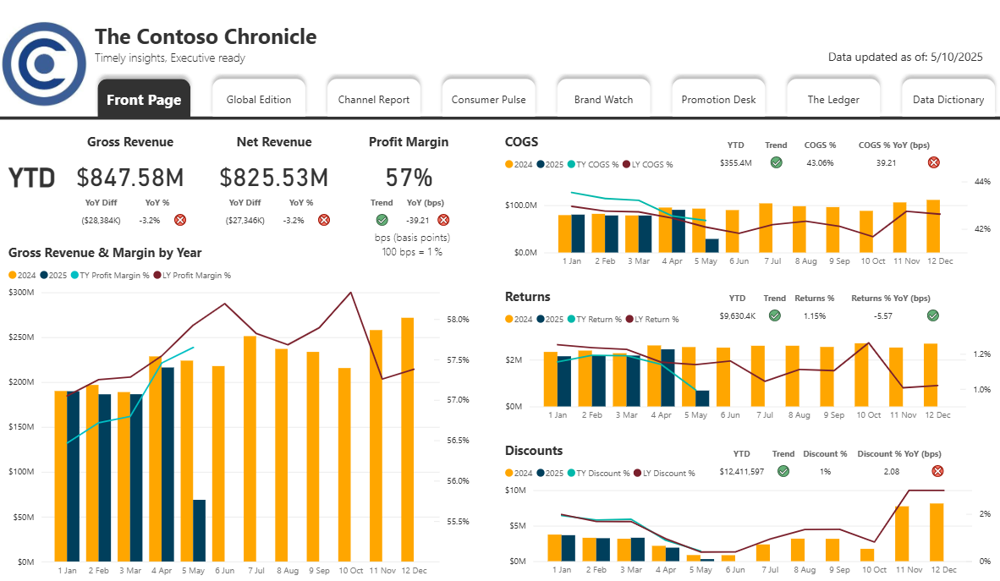

# Revenue Trend Dashboard (Power BI)

**Business Context:**  
Monthly business review dashboard designed for executives, showing revenue performance, trends, and year-over-year comparisons.

**Key Metrics:**  
- Gross Revenue, Net Revenue, Profit Margin
- COGS, Returns, Discounts (YoY, bps, and trends)

**Tools Used:**  
- Power BI, DAX, Contoso dataset (Microsoft)

**Design Rationale:**  
- Newspaper-style executive clarity
- Color-blind accessible palette, tested on https://www.color-blindness.com/coblis-color-blindness-simulator/
- Practical executive KPIs and clear trend indicators

*(Interactive visuals or demo coming soon!)*
